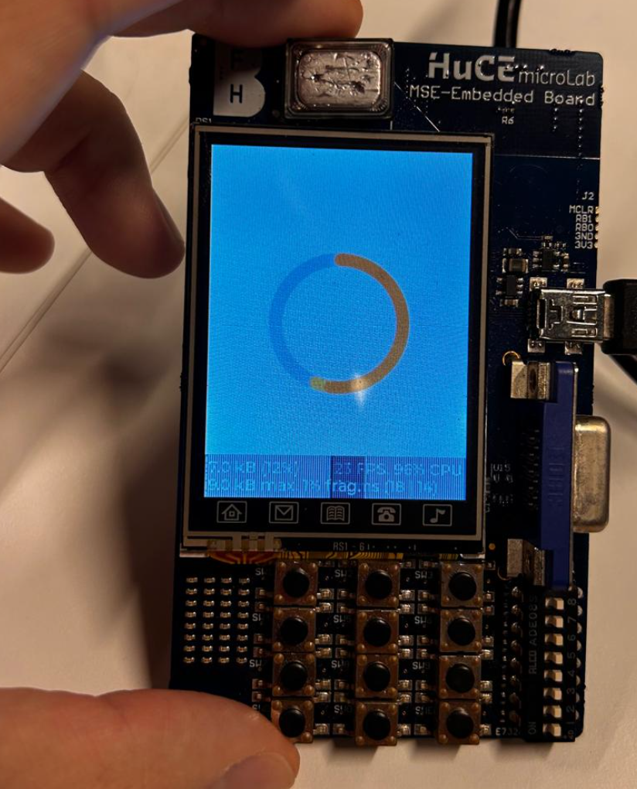

# tsm-embhardw

# Course Description

This module introduces the student to advanced concepts in modern embedded engineering.
The course concentrates on the architectures used in FPGA/SoC development and associated interfacing.
Exercises are practice-oriented and can be tested on a development board and are designed to ensure practical application of new knowledge.

# Learning objectives

The student will be able to design systems using state machines, soft-core processors, as well as interfacing peripherals to these automatons.
The student will be able to design and commission complete designs in an FPGA in an optimal manner, with optimal computation and optimal data transfers.
Exercises will be completed and applied on an FPGA development board with an Altera Cyclone IV device.

# DMA Results

Avec le DMA j'ai une moyenne de 23-24ms. Ceci est mesuré avec le timer de base, avec une granularité de 1ms.

Le tick de début est pris juste avant le début de l'écriture dans le LCD et le tick de fin est pris dans l'IRQ directement.

```c
/* Prise du tick de début */

...
start = timer_get_tick();
lcd_write_async(draw_buffer, LCD_WIDTH * LCD_HEIGHT * sizeof(*draw_buffer));
...

/* Prise du tick de fin */
static void lcd_dma_isr(void *context, alt_u32 id)
{
	is_transferring = false;
	isr_tick = timer_get_tick();
	lcd_ack_transfer();
}

/* Affichage du temps pris */
...
printf("Async Flush took %d\n", lcd_get_isr_tick() - start);
...
```

Output:

```
Async Flush took 23
Async Flush took 23
Async Flush took 23
Async Flush took 23
Async Flush took 23
Async Flush took 23
Async Flush took 23
Async Flush took 23
Async Flush took 23
Async Flush took 23
Async Flush took 23
Async Flush took 23
Async Flush took 23
```

Avec le CPU, j'ai une moyenne de 96ms. Ceci est mesuré avec le même timer.
Le tick de début est pris avant le démarrage de l'écriture et le tick de fin au retour de la fonction:

```c
uint32_t start = timer_get_tick();
lcd_write_direct(draw_buffer, LCD_WIDTH * LCD_HEIGHT * sizeof(*draw_buffer));
uint32_t end = timer_get_tick();

printf("Direct CPU write took %d\n", end - start);
```

Output:

```
Direct CPU write took 98
Direct CPU write took 96
Direct CPU write took 96
Direct CPU write took 96
Direct CPU write took 96
Direct CPU write took 96
Direct CPU write took 96
Direct CPU write took 96
Direct CPU write took 96
Direct CPU write took 96
```

# LVGL

Une fois capable d'afficher des choses sur le LCD, j'ai décidé de porter [LVGL](https://lvgl.io/) sur la plateforme
Pour cela, j'ai cloné le repertoire LVGL à côté de mon code source, lien: https://github.com/lvgl/lvgl et j'ai ajouté le répertoire source de mon project
comme un "Include Directory":

- Project -> Properties -> Nios II Application Properties -> Nios II Application Paths -> Application Include Directories -> Add


Une fois cela, j'ai du faire le portage de LVGL, le code source est disponible aussi:


